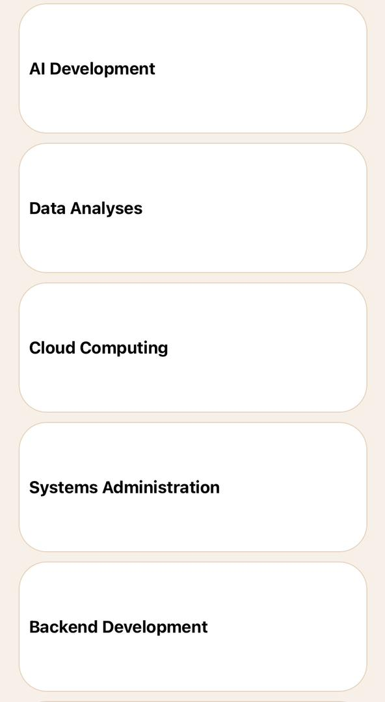

# rn-assignment3-ID-11300128

# DCIT202 Assignment 3
# 11300128

## Components Overview
### App. js
This is the main file, which describes the structure and layout of the created application. It consists of several child components and styles for the creation of the user interface.

### Components

### SafeAreaView
Makes sure the app content will be scrolled within safe area of the device, that is, the area that is safe to be used for displaying content on a device.
Grouping the entire app content distribution to avoid congruencies with the system UI components.
### ScrollView
Is an active layout that allows the app content to be scrolled.
Location: Groups the main View to enable vertical scrolling in the case when it is necessary.
### View
Serves as a context or a receptacle for different aspects of the application.
Locations:
#### Header Row
It contains the text of the greeting specified in the individual profile and the conditional picture.
Task Summary Provides an estimate of tasks that need to be accomplished with in a single day.
#### Search and Filter 
It includes the search box where the user enters their query and the filter button where the user chooses what kind of results they want to see.
### Categories
Displays categorized tasks.
Ongoing Tasks: Strongly advises for the lists of activities to be ongoing.
### Text
Displays textual information.
Greeting message.
Task summary.
Category names.
Ongoing task names.
Image
Usage: These images are displayed in the profile picture, search icon, filter icon and illustrations of the category of tasks.
Locations:
Profile picture.
Search icon.
Filter icon.
Task categories.
### TextInput
This gives an input box that would allow the user to enter a search term to search for in the task list.
### TouchableOpacity
Gently envelops the filter button so it can be applied through touch inputs.
Location: They surround the filter icon by using the vbox element.
Styles
Specified in a StyleSheet object to keep the appearance of different app elements unified.

### Container 
Defines the main container for putting individual elements and assigns colors for the background, width, and height.
#### Header
Formats the first row of the needed format: greeting’s text and the profile picture.
#### SearchFilter
These Controlling the look and feel of the search and filter area, on most sites the search box and the filter button.
Categories: Styling of the categories part of the webpage including the horizontally scrolling list of category.
#### Ongoing Tasks 
The ongoing tasks section : Determines styles for the fonts of the current tasks, as well as the vertical list dividing the tasks.

# ScreenShot
 
 
 
 
 

